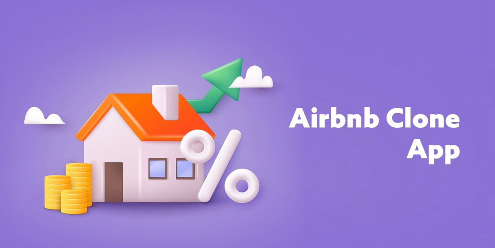

# Airbnb Clone Project Overview
This project is a full-stack Airbnb clone application that replicates core features of the Airbnb platform, allowing users to browse, book, and host short-term rentals. The purpose of this project is to gain hands-on experience in building real-world web applications using modern technologies, and to demonstrate proficiency in both frontend and backend development.
This is a Internship Booking Platform

## Project Goals
- Build a responsive, interactive web application using a modern tech stack.
- Implement key functionalities such as user authentication, property listings, and bookings.
- Practice integration of third-party services (e.g. cloud storage, payment APIs).
- Gain experience with full-stack architecture and deployment.

## Features Implemented
- 🔐 User authentication (register, login, logout)
- 🏠 Browse and search listings
- 📆 Book properties with date selection
- 💬 Add reviews for listings
- 🧑‍💼 Host dashboard to manage listings
- 📸 Image upload for properties
- 📱 Fully responsive design

## Team Roles
**Backend Developer:** Engineers the product logic and algorithms that connects the systems together. Controls the server-side logic and maintains API's that connects to components of the application.

**Frontend Developer:** Engineers the interface the user interacts with. Ensures that the designs from the UI/UX team is implemented in code.

**Database Administrator:** Manages the database to ensure data integrity ,performance and security.Ensures that database queries are optimized.

**Business Analyst:** This individual performs the tasks of understanding customer business process and translates their needs into requirements, they analyze customer feedback in order to align customer's vision with development.

**Product Owners:** He/She enusres customer satisfaction in terms of making the customer product a success. They plan the product backlog to ensure that the vision of the customer is met.It is not however technical unlike the BA.

**Project Manager:** Ensures the timely delivery of product and make sure that expenditure is within budget. Plans activities, distributes roles and updates status of the team in relation to meeting timelines.

**UI/UX Designer:** Prepares a design that best suites the product vision and user journeys to explain interactivity between the user and the screen. Focuses on enhancing experience over time.

**Software Architects:** Designs the structure of overall system architecture. Puts in place what tools will be needed to build a product solution and sets up code quality standards and reviews.

**Quality Assurance Engineers:** Ensures that application matches requirements and sees the functional and non-functional defects. Evaluates what the application should do and how the application should do it, to fufil this, QA tests are cnducted.

**Test Automation Engineers:** Fufils the tasks of writing and maintainig a series of repetitive tasks through building a tests scripts that can carry out these tasks in without human involvment.

**DevOps Engineers:** Facilates cooperation between the developement and automation teams and builds continous integration and continous delivery pipelines to ensure faster devlivery of software. Manages infrastructure and monitors logging and cloud services.

## Technology Stack
#### Frontend:
**React.js:** It is an open source Javascript library used to build responsive user interfaces on UI components.

**Tailwind CSS (or Bootstrap):** A utility first CSS framework that allows developers to rapidly build custome interfacesdirectly within HTML.

**React Router:** Used to handle client-side routing navigation in react application.

**Axios / Fetch API:** Used to make HTTP requests to backend services from the frontend.

#### Backend:
**Node.js:** A javascript runtime environment that allows users to write server side logic using javascript

**Express.js:** A minimal and flexible Node.js framework used to build Restful API and handle HTTP requests

**MongoDB:** A NoSQL database used for stroing unstructured or semi-structured data as JSON-like documents

**JWT for authentication:** Used to verify the identity of a user and their permissions for authentication and authorization

#### DevOps:
**Docker:** A containerization tool that packages the ap and its dependencies to ensure consistency across environments.

**Kubernetes:** An orchestration tool used to automate deployment, sclaing and management of containerized applications.

**GitHub Actions:** A CI/CD tool that automates testing, building and deployment of code from GitHub.

**Amazon Web Services:** A cloud platform used to deploy services 

#### Testing:
**Jest:** A testing framework for javascript, commonly used to test frontend and backend logic.

**Cypress:** An end to end testing tool that tests how users interact with the application.

**Postman:** An API testing tool that allows developers anf QA to tests HTTP requests and backend API

**Selenium:** A browser automation tool for testing web applications across different browsers

#### Monitoring:
**Prometheus:** A monitoring system that collects and stores metrics from applications and infrastructure.

**Grafana:** A visaulisation tool used to display monitoring data from prometheus or sources in real time dashbaords.

## Database Structure:
`users`: Stores information about users registered on the platform.
- A user can create mulitple preperties
- A user can write multiple reviews
- A user can perform many transactions

`property`: Contains details of properties available for booking.
- A property is owned by one user 
- A property can have multiple bookings
- A property can have multiple reviews

`booking`: Stores booking details made by users for properties.
- A booking belongs to one user 
- A booking belongs to one property 
- A booking is associalted with one payment

`payment`: Manages transaction records related to bookings.
- A payment belongs to one one booking
- Payment can be made by multiple users
- Payment must be assocaited to property

`amenity`: Contains a list of amenities available for properties.
- One property can have many amenities
- one amenity can belong to many properties
- An amenity relates with one user 

`review`: Stores reviews submitted by users for properties.
- Review can be made by one users
- Review is associated to one property
- Review is not associated with payment

## Feature Breakdown:
- 🙍🏽‍♀ User Managment: User can register , set up a user profile and delete his account
- 🚘 Property Management: Users create, update and delete their property listing
- 📅 Booking System: Users can choose a property , select dates and host can reject bookings
- 💳 Payment Processing: secure checkout with debit card, price breakdown and refund & concellation policies 
- 🔎 Search Filter: Users can search for properties
- ✍🏽 Review and Rating: Users leave reviews on product, set ratings, host can respond to reviews which creates trusts

## 🔐 API Security
To ensure that our backend APIs are protected from unauthorized access and malicious attacks, the following security measures will be implemented:

1. **Authentication**
- We will use **JWT (JSON Web Tokens)** to authenticate users.
- Only users with valid login credentials will be issued a token, which must be included in all protected API requests.
- **Why it’s important:** Prevents unauthorized users from accessing protected resources like user profiles, bookings, or property management.

2. **Authorization**
- Role-based access control (RBAC) will be enforced (e.g., distinguishing between guests and hosts).
- Certain endpoints (like creating a property) will only be accessible to authenticated hosts.
- **Why it’s important:** Ensures users only perform actions they’re permitted to (e.g., users can’t delete other people’s bookings).

3. **Rate Limiting**
- Implement rate limiting using tools like **Express Rate Limit** to control how many requests a client can make in a set time.
- This helps prevent abuse (e.g., brute force login attempts or DDoS attacks).
- **Why it’s important:** Protects server resources and improves stability and response time for legitimate users.

4. **Input Validation and Sanitization**
- Use libraries like **express-validator** to validate incoming requests.
- Prevent injection attacks (e.g., SQL injection, NoSQL injection, or XSS).
- **Why it’s important:** Ensures data integrity and protects the backend from malicious payloads.

5. **HTTPS**
- All API requests will be made over HTTPS to ensure secure data transmission.
- **Why it’s important:** Protects user credentials, personal data, and payment information from being intercepted during transmission.

## 🚀 CI/CD Pipeline
**CI/CD** stands for **Continuous Integration** and **Continuous Deployment/Delivery**. It is a set of practices and tools that automate the process of testing, building, and deploying applications. 

- **Continuous Integration (CI):** Automatically tests and integrates code changes as they are pushed to the repository.
- **Continuous Deployment/Delivery (CD):** Automatically deploys those tested changes to a staging or production environment.

### Why CI/CD is Important?
- 🛠️ **Faster Development:** Automates repetitive tasks like testing and deployment.
- ✅ **Higher Quality:** Ensures that new code does not break existing functionality through automated tests.
- 🔄 **Consistency:** Reduces human error by automating builds and deployments.
- 🚀 **Faster Releases:** Speeds up the time between coding and production deployment.

### Tools We Can Use
- **GitHub Actions:** Automate workflows for testing and deploying on every push or pull request.
- **Docker:** Containerize the application to ensure consistent environments across development, testing, and production.
- **Jest / Mocha:** For unit and integration testing in the CI phase.
- **Heroku / AWS / Vercel:** For automatic deployments once code passes all tests.
